# WriteUp - ILoveFrontend - CTF - 2025

## Флаги
- [Глобальный](#глобальный-флаг)
- [Обязательные](#обязательные-флаги)
  + [Журнал](#журнал)
  + [Secret](#secret)
  + [Emoji](#emoji)
  + [Доска обявлений](#доска-обявлений)
  + [CHAPI](#chapi)
  + [Кроссворд](#кроссворд)
  + [Флаг в рамочке](#флаг-в-рамочке)
  + [Атбаш](#атбаш)
  + [WebGL](#webgl)
  + [Черный ящик](#черный-ящик)
  + [Артефакт](#артефакт)
  + [Лабиринт](#лабиринт)
  + [Firewall](#firewall)
  + [Что ты такое?](#что-ты-такое)
  + [Блокчейн](#блокчейн)
  + [PDF](#pdf)
  + [Блог](#блог)
  + [Отчет](#отчет)
  + [Недоработанный интерфейс](#недоработанный-интерфейс)
  + [Стерео Лиза](#стерео-лиза)
  + [Never Gonna Give You Flag](#never-gonna-give-you-flag)
- [Опциональные](#опциональные-флаги)
  + [Сломанная клавиатура](#сломанная-клавиатура)
  + [Vault](#vault)
  + [ch-ts](#ch-ts)
- [Благодарности](#благодарности)


## Глобальный флаг

Глобальный флаг является разминкой, его можно найти в обучалке

Флаг: `{flag_tutorial_abc}`


## Обязательные флаги

### Журнал

Тыкаясь по уровню натыкаемся на журнал и проотыкиваемся до конца диалога

> Смотри-ка, уже пару лет, как записался в журнале под именем {flag_easy_peasy}, а никто и не заметил.

Флаг: `flag_easy_peasy}`


### Secret

Все также тыкаемся по уровню и в одном из терминалов после команды `help` видим, что имеется команда `secret`. Набрав её, получаем флаг

Флаг: `{flag_terminal_asd}`


### Emoji

Один из персонажей очень неловко шутит и выдает следующий диалог
> {🚩_🍉_🍪_🕜} — вот что это обозначает? Часики, вроде как, 1330 показывают.

Че у нас тут? Эмодзи, понятно, берем и переводим по факту че видим

Первый вариант был `{flag_watermelon_cookie_watch}` - не подошел

Вторым - `{flag_watermelon_cookie_clock}` - не подошел

На третьей попытке я перечитал текст заадиня и на авось попробовал следующий вариант `{flag_watermelon_cookie_1330}`

Флаг: `{flag_watermelon_cookie_1330}`

### Доска обявлений

Одно из сообщений
> А вот это уже что-то интересное. «e2ZsYWdfYmFzZTY0X2VuY29kaW5nfQ==»

Видим базу - декодим
```bash
echo -n e2ZsYWdfYmFzZTY0X2VuY29kaW5nfQ== | base64 -d
# out: {flag_base64_encoding}
```

Флаг: `{flag_base64_encoding}`


### CHAPI

Задание
> Ничего себе! Тут кто-то прямо на рабочем терминале [джаваскриптом балуется](https://hghlycsm.ctf-2025.ilovefrontend.ru/)

Ну побалуемся и мы!

При входе видим следующее, у нас есть инпут в которм есть какой-то код 

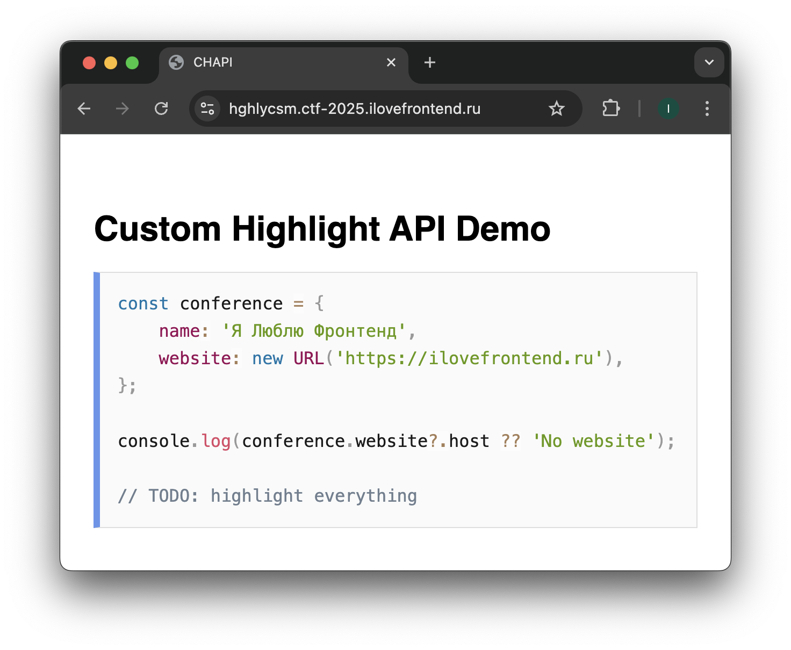
> ! Изначально в блоке TODO было следующее сообщение `//TODO: add quine` так что я отталкивался от той подсказки

Сам код инпута валяется в файле [script.js](https://hghlycsm.ctf-2025.ilovefrontend.ru/script.js)

Первые мысли были загуглить что вообще такое `quine` в программировании. Википедия выдала следующий результат:

> ...program that takes no input and produces a copy of its own source code as its only output.

Далее решил прошерстить код, и заметил функицю с названием `paintSpecialTokenHighlights`, которая делает какую-то "специальную" постветку для символов на следующих позициях:

```js
const pos = [ 20, 567, 588, 589, 606, 801, 830, 831,832, 833, 834,835, 836, 837, 838, 845, 1200, 1707, 1722, 1813, 1949, 2324 ];
```

На значение каки-либо символов из латиницы это не похоже, значет оно реально выделает какие-то осбоые символы

Уже зная что такое `quine` и имея позиции, можно подумать что это позиции символов самого файла `script.js`.

Так что, либо можно закинуть сам исходный код в инпут, либо не делать это ручками а сделать с помощью JS

```js
// здесь наши позиции
const pos = [...]

// здесь строка с исходным кодом
const src = `...`
pos.map(el => src[el]).join("")
// out: '{flag_highlight_a1tt0}'
```

Флаг: `{flag_highlight_a1tt0}`


### Кроссворд

Задание
>О-па! Сборник ребусов и [загадок](https://qzcrswrd.ctf-2025.ilovefrontend.ru/)! Неразгаданный! Ещё и со схемами для вязания на развороте — идеально!

Инспектим, видим кроссворд со скрытым списком вопросов и то что перед вопросами есть пробелы `&nbsp;`

Пока решал - понял что эти пробелы это оффсет от первой клетки слева, поэтому все что нужно это решить кроссворд и получить флаг

Флаг: `{flag_quiz_again}`


### Флаг в рамочке

Задание
> [Флаг](./assets/flag.gif) в рамочке!

Что делает каждый уважаемый себя CTF'ер, когда видит файл с изображением? - Катает.

А как Катать спросите вы? С помощью команды cat:

```bash
cat -v path/to/image/flag.gif
```

В этом случае все проканало, поэтому берем флаг который валялся в конце файла и идем дальше

Флаг: `{flag_in_the_end_of_gif89a}`


### Атбаш

Задание
>Опять кто-то балуется. Уверен, это что-то простое, но что? {uozt_zgyzhs_xrksvi_x09s}

Тут просто по привычке проверил все простые шифры и попался на Атбаш

Флаг: `{flag_atbash_cipher_c09h}`


### WebGL

Задание
> [Картинка барахлит](https://gttttttt.ctf-2025.ilovefrontend.ru/). Опять в код лезть надо.

Смотрим, видим, что код не работает. Поэтому выгружаем к себе и начинаем дебажить

Идем смотреть плюс-минус понятную [доку](https://metanit.com/web/webgl/)

Смотрим в раздел [вершин](https://metanit.com/web/webgl/2.4.php) видим, что все норм - идем дальше

Смотрим в раздел [отрисовки](https://metanit.com/web/webgl/2.5.php) видим, что тут у нас проблема в методе `drawArrays` в параметре `count`. Сейчас он пытается отрисовать всего 3 вершины и методом подбора выясняем, что нам надо:

```js
gl.drawArrays(gl.POINTS, 0, vertices.length / 3);
```

Смотри в раздел [шейдеров](https://metanit.com/web/webgl/3.1.php) видим, что никакую переменную поидее передавать не надо

Наш код `gl_FragColor = vec4(coordiantes, 0.05);`

Меняем на `gl_FragColor = vec4(1, 1, 1, 1);`

Перезагружаем и о чудо, все работает, но часть кода уехала за канвас вправо

Мапим массив вершин следующим образом:

```js
const vertices = [...].map((el, index) => {
  if (index % 3 === 0) {
    return el * 0.5 - 0.8
  }

  return el;
})
```

В очередной раз перезагружаемся, и видим что флаг есть, но перевернутый, просто скейлим канвас следующим образом через css `transform: scaleY(-1)` и получаем наш флажочек:

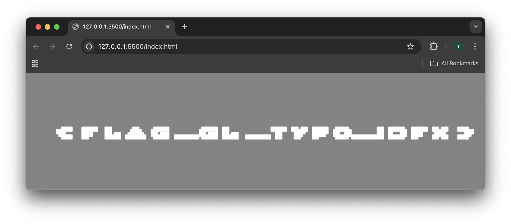

Флаг: `{flag_gl_typo_idfx}`

### Черный ящик

Задание
>Пора изучить [данные чёрного ящика](https://profprof.ctf-2025.ilovefrontend.ru/).

Там выкачиваем файл `admin-panel.heapsnapshot`

Идем в девтулзы во вкладку `memory`, загружаем туда файл, нажимаем `cmd+f` и вводим `{flag`

Находим флаг и идем дальше

Флаг: `{flag_profile_memory_dump_esdfsdf}`


### Артефакт

Текст задания
>Ещё один интересный [артефакт](https://bndgnwsm.ctf-2025.ilovefrontend.ru/). Покой нам только снится.

Переходим по ссылке, инспектим

Видим в что используется wasm `window.wasmBindings = bindings;`

Cмотрим что есть в `wasmBindings` видим 3 метода `run`, `initSync` и `default`

Потыкав методы видим, что `default` и `initSync` по факту делаю одно и тоже, просто одно промис а другое нет


Используем `initSync`, который выплевывает память в виде буфера

```js
const memory = (new TextDecoder("utf-8")).decode(wasmBindings.initSync().memory.buffer)
```

Получаем длинную конитель из символов, оставляем только печатные:

```js
memory.replace(/[^\x20-\x7E]/g, '')
```

Получаем длинную строчку в которой есть флаг - радуемся

Флаг: `{flag_wasm_bindgen_easy_peasy}`


### Лабиринт

Текст задания
>Это что ещё за [лабиринт](https://mzmzmzmz.ctf-2025.ilovefrontend.ru/)? Его тут не было.

Заходим, настольгируем, но о главном не забываем

Замечаем что карта снизу какая-то очень мелкая и вообще какая-то странная

Роемся в конфиге и видим что `data` - глобальный обект

Далее играемся с размерами радара

```js
data.radar.cells = 50
data.radar.size = 2
```

Афигеваем с того, что карта это QR код, только чуть-чуть неполный, и вместо того, чтобы страдать и править код отрисовываем карту в браузере с помощью гридов, размером 68x68

```js
const drawQR = () => {
  const QR = document.createElement('div')
  QR.style.display = 'grid'
  QR.style.gridTemplate = 'repeat(68, 5px) / repeat(68, 5px)'

  document.body.appendChild(QR)

  data.map.flat().forEach((el) => {
    const div = document.createElement('div')
    div.style.background = el ? 'black' : 'white'
    QR.appendChild(div)
  })
}

drawQR()
```

Сканируем код, получаем флаг

Флаг: `{flag_maze_qrcode_9ehrnf}`


### Firewall


Задание
> Не могу пробиться через [firewall](https://frwlmder.ctf-2025.ilovefrontend.ru/). Это не наша защита, её кто-то накатил поверх!


Ну зайдем, ну посмотрим

Видим следующее, какая-то приложуха, которая открывает web-сокет на `sync`, `add` и `remove` и на каждое поступление или синк отрисовывает кружочек с текстом рядом.

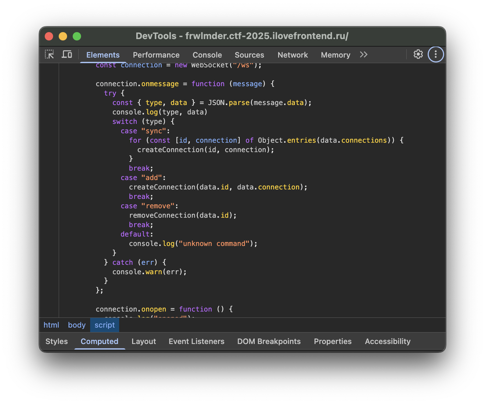

Вообще на этом задании встряли многие, но потыкав во все кружочки на уровне, можно было наткнуться на следующую фразу

> Давай пробовать ддосить firewall! Вдруг поможет?

Ну в отчаянье и не такое сделать можно. Ну раз так то ладно, консолим следующее:

```js
Array.from({ length: 100 }, () => { new WebSocket('ws') })
```

Видим следующее, что начинаются появляться точки, но когда запросов стало много начали появляться нужные нам флажочки


Долго не думаем, берем флаг и идем подверждать. firewall - ВСЁ

Флаг: `{flag_firewall_over_04nergf}`


### Что ты такое?

Задание
>[Что ты такое???](https://ctf-2025.ilovefrontend.ru/)

Таска достаточно душная, но легкая, поэтому вот:
1. Создаем недостающие переменные цветов (лучше подключить только `--green`)
2. Крутим вертим `div.pain`
3. Получаем флаг 

Флаг: `{flag_leo_father_1503}`


### Блокчейн

Задание
> Так, [что у нас тут](https://b99mraxx.ctf-2025.ilovefrontend.ru/)?

Заходим, читаем и узнаем следующее, работает все нестабильно, корректных цепочек мало

Переходим по ссылке и смотрим что вообще там есть

Открываем первый JSON файл и наблюдаем следующую картину, блок выглядит так:

```json
{
  "index": 0,
  "timestamp": <timestamp>,
  "data": "<data>",
  "previousHash": "<previousHash>",
  "hash": "<hash>"
},
```

Но когда смотрим дальше, то понимаем что поле `previousHash` не совпадает со значением `hash` предыдущего

Первая мысль встает, а есть ли вообще валидная цепочка? Хотябы одна? Давайте поищем:

```js
// 
const baseURL = "https://b99mraxx.ctf-2025.ilovefrontend.ru/data/"

const text = await fetch(baseURL).then(res => res.text());

// получаем ссылки на JSON файлы
const list = text.split('\n')
  .filter(el => /href=\"chain_\d{4}.json/.test(el))
  .map(el => el.match(/chain_\d{4}.json/)[0]);

const correct = [];

for (const item of list) {
  const url = baseURL + item
  const data = await fetch(url).then(data => data.json())

  if (data[0].hash !== data[1].previousHash) {
    console.debug("Wrong Chain:", url)
    continue;
  };

  console.debug("CORRECT CHAIN:", url)
  correct.push(url)
}

console.debug(correct)
// out: [ 'https://b99mraxx.ctf-2025.ilovefrontend.ru/data/chain_5840.json' ]
```

Отлично, корректная цепочка все-таки есть, может быть мы на верном пути

Заходим, видим что список длинный, попробуем проверить последнее значение
> Не знаю почему так решил при первом прохождении, но флаг оказался верным, скорее всего там должна быть какая-то логика, может быть что-то связанное с `актуальным` значением цепочки

Флаг: `{flag_ojhuy_9xrk7f98bc}`

### PDF

Задание
> Прости, Аллочка, но мне нужны твои [файлы на рабочем столе](https://rfccfscr.ctf-2025.ilovefrontend.ru/).

Идем по ссылке, и видим один постер в формате `jpg` и несколько `pdf` файлов

Томить не буду, при проверке ПДФ можно наткнуться на [rfc6713.pdf](https://rfccfscr.ctf-2025.ilovefrontend.ru/rfc6713.pdf)

Что же в нем такого подозрительного? Ну а сколько вы видели PDF файлов видели которые умеют вызывать ]`alert()`?!
> Особенно когда у тебя на машинке нет такого понятия как диск D

Ну значит выгружаем файл и используем `strings` в терминале:

```bash
srings path/to/pdf/rfc6713.pdf
```

В одной строке вывода видим это:
```bash
# out: /JS <6170702E616C657274282252656164206572726F722120443A2F646F63756D656E74732F7266732F726663363731332E70646622293B0A2F2F207365637265743A205A6D78685A31397163313970626C39775A475A66615735715A574E3058334E734F544D3D>
```

Делаем следующее:
```bash
echo 6170702E616C657274282252656164206572726F722120443A2F646F63756D656E74732F7266732F726663363731332E70646622293B0A2F2F207365637265743A205A6D78685A31397163313970626C39775A475A66615735715A574E3058334E734F544D3D \
| xxd -r -p
# app.alert("Read error! D:/documents/rfs/rfc6713.pdf");
# // secret: ZmxhZ19qc19pbl9wZGZfaW5qZWN0X3NsOTM=%  
```

Ну это БАЗА!

```bash
echo ZmxhZ19qc19pbl9wZGZfaW5qZWN0X3NsOTM= | base64 -d
# out: flag_js_in_pdf_inject_sl93
```

Флаг: `{flag_js_in_pdf_inject_sl93}`


### Блог

Задание
> О-па, кто-то ведёт [свой блог](https://myblgspr.ctf-2025.ilovefrontend.ru/) прямо с рабочего места.

Заходим, по наитию тыкаем все посты и замечаем, что среди айдишников с 1 по 9 не хватает 4

Идем в `/posts/4`, видим следующее:

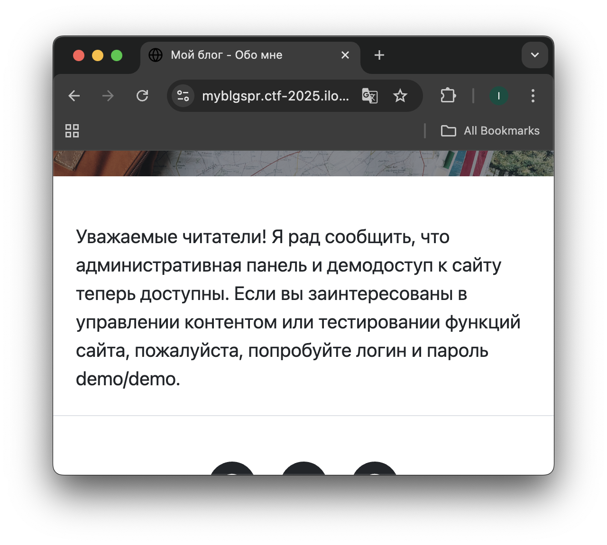

Я человек простой, вижу логин и пароль, иду их проверять

А где у нас находится админка? первая мысль `/admin`. Проверяем:

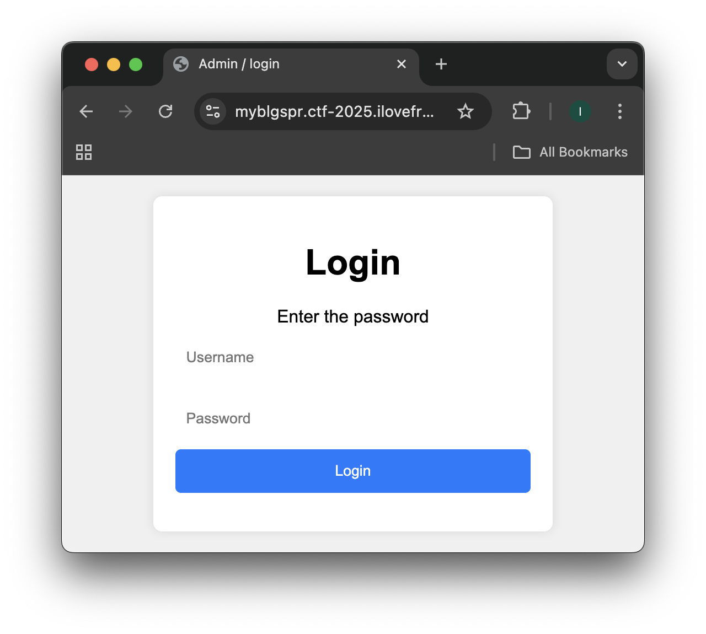

Вуаля! А теперь логинимся под `log: demo / pas: demo`

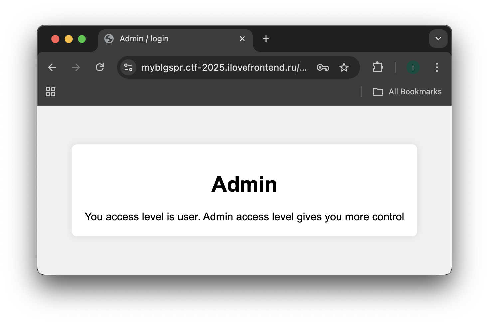

Так-c, мы залогинились и сайт говорит, что мы пользователь, и дразнит нас наличием ~~человеческих~~ прав у админа

А как приложение понимает кто залогинен? конечно же через cookie. Идем смотреть:

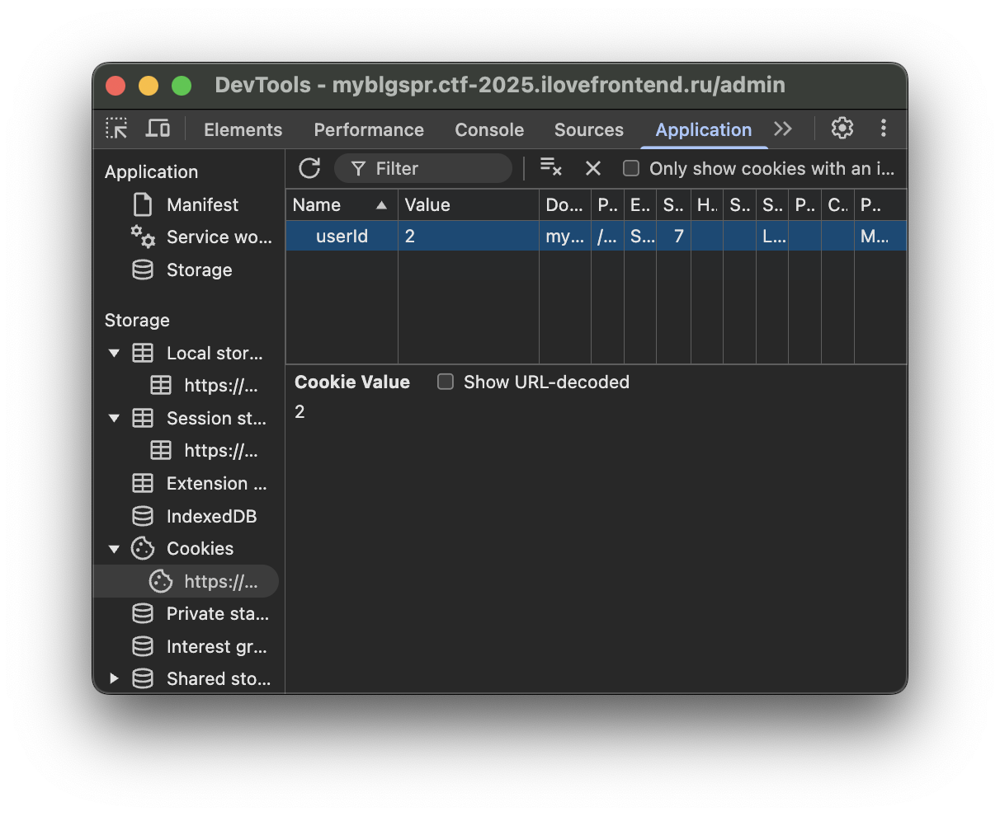

Понятно, авторизация происходит чере куки, при том куки никак не защищены, сервис отличает нас от другого пользователя просто числом.

Сейчас у нас `userId=2`, а как вы думаете какой ID пользователя у админа? Конечно же 1!

Подменяем куку с 2 на 1, перезагружаемся и получаем:

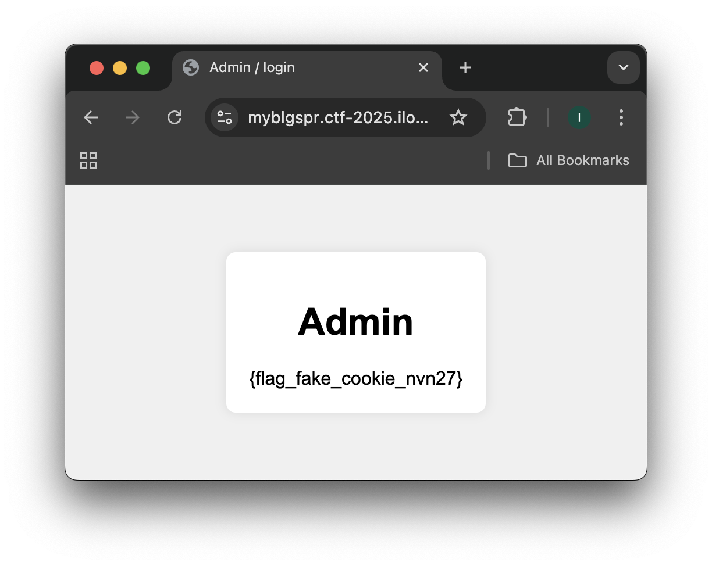

Флаг: `{flag_fake_cookie_nvn27}`


### Отчет

Текст задания
> Отчёт? Будет тебе [отчёт](https://frncscrn.ctf-2025.ilovefrontend.ru/). Сейчас распечатаю.

Инспектим, видим подключенные стили `./print.css`

Там видим замечательную строчку:

```css
...
content: counter(page, repeat(
  "x70", "x72", "x69",
  "x6e", "x74", "x5f",
  "x63", "x73", "x73",
  "x5f", "x31", "x35",
  "x31", "x37", "x7d",
  "x7b", "x66", "x6c",
  "x61", "x67", "x5f"
));
...
```

Не знаю как вы, но я вижу что-то с печатными символами, давайте-ка задекодим их из хексов в строку:

```js
[
  "x70", "x72", "x69",
  "x6e", "x74", "x5f",
  "x63", "x73", "x73",
  "x5f", "x31", "x35",
  "x31", "x37", "x7d",
  "x7b", "x66", "x6c",
  "x61", "x67", "x5f"
].reduce((acc, hex) => acc += String.fromCharCode('0' + hex), '')
// out: print_css_1517}{flag_
```

Не слишком грациозно, зато флаг есть

Флаг: `{flag_print_css_1517}`


### Недоработанный интерфейс

>Тот момент, когда с доступностью интерфейса поработали, но [не доработали](https://brncdnrb.ctf-2025.ilovefrontend.ru/).

Такс, что это тут у нас?

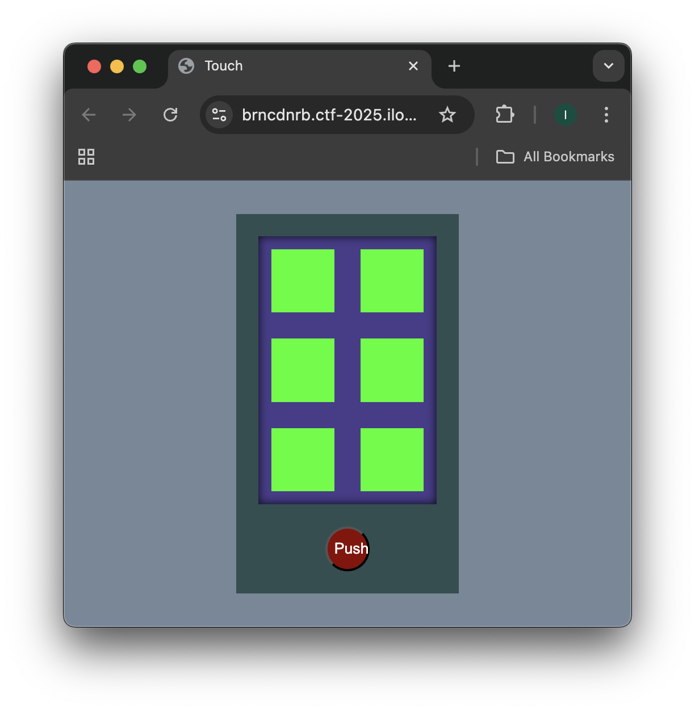

Смотрим в стили и нажимаем на "БОЛЬШОЙ КНОПКА КРАСНЫЙ КАК БОРЩЧ"

Но ничего не происходит, дебажим стили и видим:

```css
...
@property --on {
  syntax: "on";
  inherits: true;
  initial-value: on; 
}

...

animation: a7 1s linear infinite;

...

/* border-radius: 50%; */

...
```

1. Заменяем значение `initial-value` на любое другое
2. Замедляем время анимации `a7` до хотябы 20 секунд
3. Раскоменчиваем заботливо оставленный `border-radius: 50%`

Жмем кнопку, и видим интересную анимацию

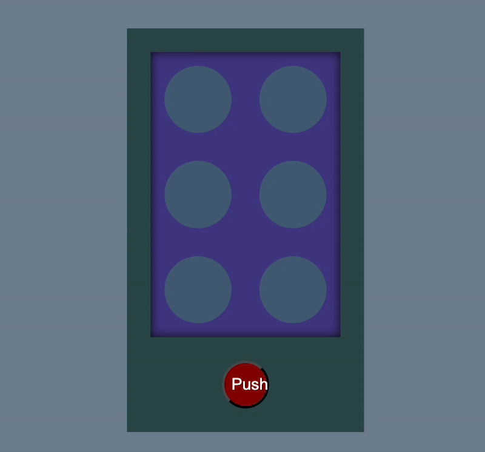

Ничего не напоминает? да это же шрифт Брайля

Идем искать онлайн тулзу для того, чтобы это все раздекодить, например [вот это](https://www.dcode.fr/braille-alphabet)

Устанавливаем `English (Unified English Braille)` и вбиваем символы по одному, иногда 1 символ держиться дольше остальных по времени - значит там их 2:

Флаг: `{flag_accessibility_is_important_k4n90}`

### Стерео Лиза

Текст задания
>Это [пасхалка](https://jkndlsmn.ctf-2025.ilovefrontend.ru/) или что-то и правда сломалось?

Заходим, видим бессмыслицу, и проваливаемся сразу же в dev-tools. В теге `head` видим линку

```html
<link rel="alternate" type="text/html" href="mirror.html">
```

Идем в `/mirror.html` и снова видим бессмыслицу, смотрим разметку, и вспоминаем задания с типами с 2024 года, понимаем что браузер глупый, и идем пользоваться лучшим браузером 2025 века

```bash
curl -s https://jkndlsmn.ctf-2025.ilovefrontend.ru/
```

Получаем статусы из Вконтакте 2007ого года, ностальгируем

Не буду долго томить, в случае если мы сходим в `/mirror.html` то получим зеркальную копию этого шедевра.

Это было последнее задание, мозги уже не хотели соображать, поэтому я решил обратиться в чат за подсказкой.

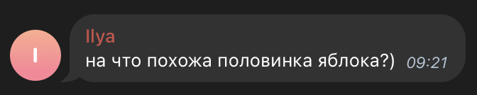

Получив такой ответ я понял что мне снова нужно идти к мудрецам и я не был разочарован

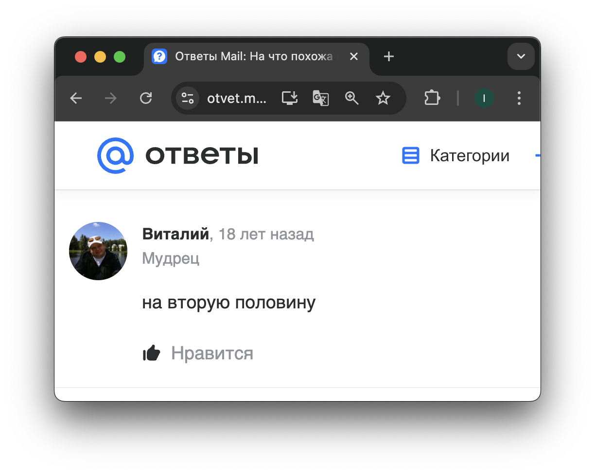

Точняк, вы же не забыли еще что у нас есть оригинал и ~~жалкая пародия~~ отзеркаленная копия? Может нужно попробовать сравнить их и посмотреть различия

Но для начала нужна небольшая подготовка, а именно, каждую строку копии нужно развернуть

```js
const reversed = mirror.split('\n')
  .map(el => Array.from(el).reverse('').join(''))
  .join('\n')
```

И дальше пробегаемся по каждому символу и оставляем только те которые не похожи

```js
const getBody = async (url) => {
  const res = await fetch(url)
  const text = await res.text()
  
  // Возвращаем только то что в body
  return text.split(/(<body>|<\/body>)/)[2]
}

const getDiff = async () => {
    // Оригинал
    const original = await getBody('/index.html')
    // Отзеркаленное
    const mirror = await getBody('/mirror.html')
    
    // Разворачиваем каждую строку
    const reversed = mirror.split('\n')
        .map(el => Array.from(el).reverse('').join(''))
        .join('\n')
    
    // Если разные то добавляем элемент из оригинала
    // нет - пропускаем
    const result = Array.from(original).reduce((acc, el, index) => {
      if (el !== reversed[index]) acc += el;

      return acc;
    }, '')

    console.log(result)
}

getDiff();
```

Впихиваем это в консоль и вот он наш многострадальный флаг

Флаг: `{flag_mona_7tjq}`


### Never Gonna Give You Flag

Задание:
> Друг просит помочь [потестировать карточку для социальных](https://ctf-2025.ilovefrontend.ru/) сетей. Говорит, надо для пресс-релиза во всех сетях

Что увидим когда зайдем? вот что:


Ну это значит что мы попались на рикрол ~~и пора выключать компьютер и идти спать~~

Попадаемся на тег `title` и понимаем что нас ~~нае*али~~ обманули:

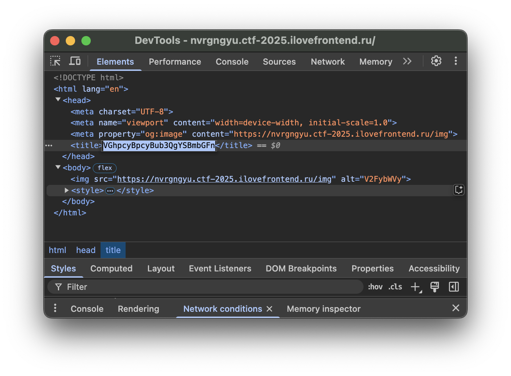

```bash
echo VGhpcyBpcyBub3QgYSBmbGFn | base64 -d
# out: This is not a flag
```

Ну и ладно, ну и пожалуйста

Инспектим код дальше, вспоминаем про какие-то карточки и про каких-то друзей - идем искать как это работает


Замечаем мета теги и вспоминаем зачем они нам нужны, особенно с пропсой `og:image`

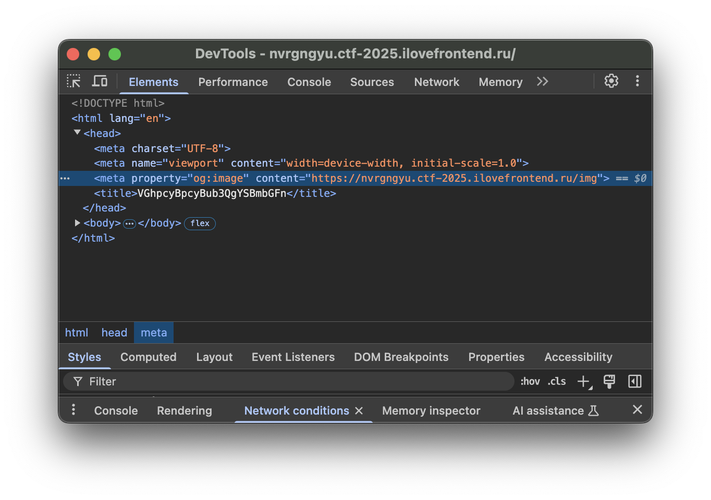

Узнаем что? `og:image` — это картинка которая будет подтягиваться к публикации при репосте.

Тут есть 2 путя дальнейших событий:
- Зарикролить друзей
- Зарикролить себя

Если вы гуглили "кто такие друзья", то вам также как и мне прийдется использовать второй способ

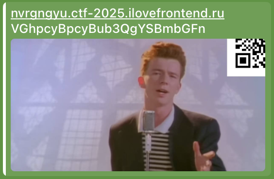

Опа, я вижу КУРКОД!
Хм, но при открытии в браузере мы получали гифку, что-то тут нечисто.

Как сайт может отправлять одну картинку в Телеграмм и отрисовывать совсем другую в браузере?

Дело в хэдере `User-Agent`, именно благодаря нему сайт понимает кто мы. Но тут же появляется другой вопрос, а какой нафиг юзер агент у телеги? Она что, тоже браузер?!

Спрашиваем поисковик, какой `User Agent` у телеги, и первой же ссылкой попадаем [сюда](https://github.com/serjo96/Telegram-user-agent) и читаем следующее

> Telegram User Agent is a backend service that enables a Telegram bot to perform user operations and interact with external APIs

Ну ШТОШ! Вот мы и поняли что мы должны быть ботом
~~Cпасибо, до свидания, увидимся в следующей жизни, когда я стану ботом~~. Значит боты должны слать свои заголовки!

Пробуем воссоздать условия репоста в телеге, превентивно узнав, что нужен `User-Agent` с паттерном `TelegramBot`

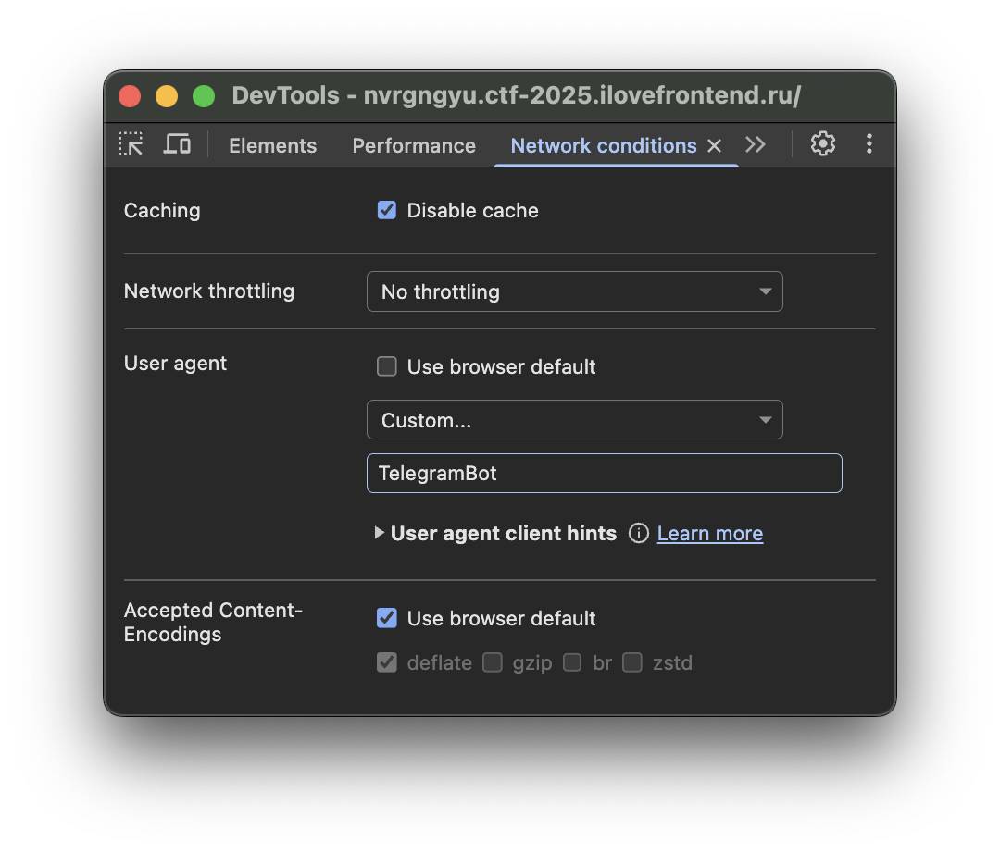

ХОБА! у нас получилось воссоздать условия репоста, мы уже не такие жалкие
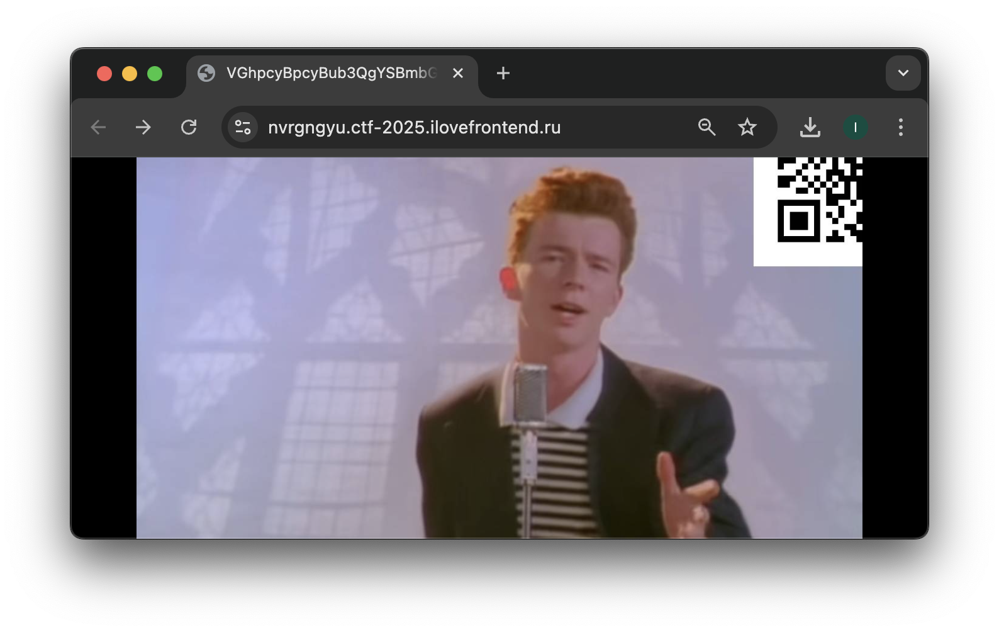

Но есть одно но! Где остальные части QR кода? Потому что с 1/4 мы ничего сделать не сможем - значит должны быть другие значения для заголовка `User-Agent`, которые будут давать подобный результат.

Вот было бы здорово, если бы нашелся какой-нибудь список со значениями юзер агентов ботов? А стоп, дк он есть, вот же он родненький, [СЮДАААА](https://raw.githubusercontent.com/monperrus/crawler-user-agents/refs/heads/master/crawler-user-agents.json)

Но санчала давайте-ка посмотрим, какой минимум значений нам надо перебрать:

```bash
curl -s \ 
https://raw.githubusercontent.com/monperrus/crawler-user-agents/refs/heads/master/crawler-user-agents.json \
| grep pattern \
| wc -l

# out: 591
```

Пфф, ну впринципе не так ужи и много! ~~начинаем вбивать каждый руками и смотреть~~

Окстись, а если бы их было 592?!

>Ты чо, е*анутый? А ниче тот факт, что этих ботов может быть большое количеств, и что на перебор каждого значения уйдет много ~~жижки~~ времени?

Ну давайте думать.
У нас есть список, и нужно сбегать с каждым значением к Рику и получить от него недостающие части флага.

Для начала нам нужно сделать пару запросиков и посмотреть что приходит при успехе.
Я, конечно, это уже сделал и понял, что в случае успеха, `Content-Type` будет со значением `image/jpeg`, а в случае неудачи `image/gif`.

Значит код будет следующим:

```js
// идем за изображением
const checkCard = async (UA) => {
  const res = await fetch( 
     // Здесь мы идем СРАЗУ за ФОТО
    "https://nvrgngyu.ctf-2025.ilovefrontend.ru/img",
    { headers: {
      // это наш инстанс юзер агента
      "user-agent": UA,
      // нужно, просто нужно
      "response-type": 'stream',
    }}
  );

  // смотрим контент тайп, если не ЖиПЕГ, то нам он нафиг не нужон
  if (res.headers.get('content-type') === 'image/gif') {
    throw "Пшел в жопу!"
  };

  // возвращаем байтики, они нам еще пригодятся
  return await res.bytes();
}
```

Так, то что нам нужно от того что нам не нужно мы отличать научились, что дальше?

А дальше нужно взять по инстансу из каждого паттерна, который мы будем прокидывать в функцию `checkCard`:


```js
const res = await fetch(crawlersURL)
const json = await res.json()
/**
 * здесь берем по одному ИНСТАНСУ если они не пусты
 */
const UAList = json.reduce((acc, el) => {
  if (el.instances.length) {
    acc.push(el.instances[0])
  } 

  return acc;
}, []);
```
Теперь мы не просто дураки, мы дураки со списком!

Уже лучше, осталось всего-то создать директорию и пробежаться по каждому юзер агенту.

Ну и записать файлики тоже было бы не плохо, а то зачем мы вообще все это делали?

```js
// удаляем директорию если существует и создаем новую
await fs.rm (out, { recursive: true, force: true })
await fs.mkdir(out);

for (const UA of UAList) {
  try {
    const bytes = await checkCard(UA)
    // если все норм то создаем файл из контент хэша 
    // в случае повторения файла, мы просто его перезапишем
    const name = hash("md5", bytes) + '.jpeg'
    await fs.writeFile( resolve(out, name), bytes)
  } catch {
    // Тут просто продолжаем
    continue;
  }
}
```

Так-с, все приготовления мы сделали, и получили следующий код:

```js
const fs = require("node:fs/promises");
const { hash } = require("crypto");
const { resolve } = require("path");

const crawlersURL = "https://raw.githubusercontent.com/monperrus/crawler-user-agents/refs/heads/master/crawler-user-agents.json"
const imgURL = "https://nvrgngyu.ctf-2025.ilovefrontend.ru/img";
const out = resolve(__dirname, "rick-out");

const checkCard = async (UA) => {
  const res = await fetch(imgURL, {
    headers: {
      "user-agent": UA,
      "response-type": 'stream'
    }
  });

  if (res.headers.get('content-type') === 'image/gif') {
    throw "Bad User Agent"
  };

  return await res.bytes();
}


(async () => {
  const res = await fetch(crawlersURL)
  const json = await res.json()

  const UAList = json.reduce((acc, el) => {
    if (el.instances.length) {
      acc.push(el.instances[0])
    } 

    return acc;
  }, []);

  await fs.rm (out, { recursive: true, force: true })
  await fs.mkdir(out);
  
  for (const UA of UAList) {
    try {
      const bytes = await checkCard(UA)
      const name = hash("md5", bytes) + '.jpeg'
      await fs.writeFile( resolve(out, name), bytes)
    } catch {
      continue;
    }
  }
})();
```

Запускаем наш скрипт:
```bash
node ./rick.js
# 23.104s // замер через console.time
```

Получилось все значительно быстрее чем перебирать руками (если ваши руки быстрее, то ФЛАГ ВАМ В РУКИ, ХА!)

Идем в `rick-out` и смотрим что мы получили:


Ну, далее собираем фотки ручкми, параллельно гладя себя по головке

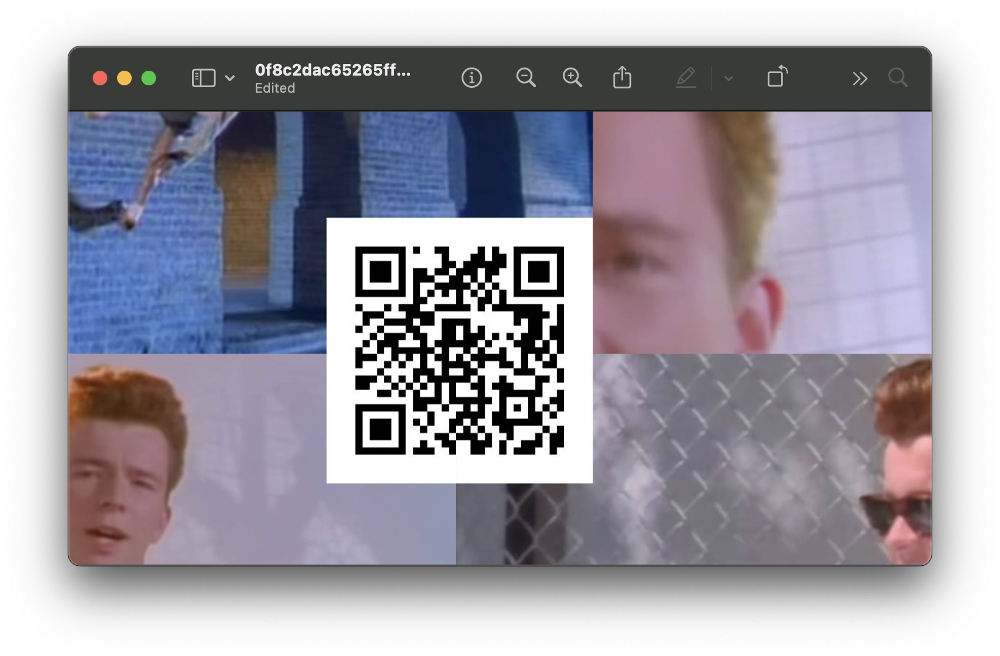

Сканируем и получаем заветный флажок 

Флаг: `{flag_never_gonna_open_graph_r1ck}`


## Опциональные флаги

### Сломанная клавиатура

Текст задания
> Да вы издеваетесь! [Клавиатура сломалась](https://kbrdbrkt.ctf-2025.ilovefrontend.ru/)? Вот прямо сейчас?

Заходим, и видим, что клавиатура действительно сломалась, идем в магазин, покупаем новую и решаем таску дальше

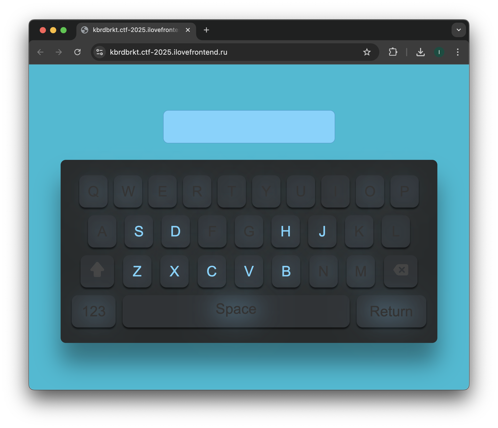

Когда что-то не работает, что-то обычно начинает ругаться, и очень часто это даже не заказчик, поэтому смотрим консоль

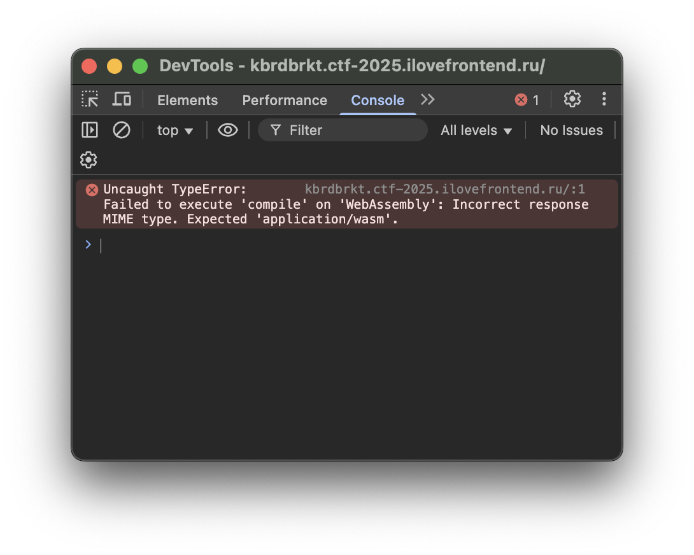

Видим, wasm, начинаем ругаться вместе с приложением.

Решаем сделать все по красоте, идем во вкладку `network` и выгружаем оттуда все файлы и собираем проект локально.

И о чудо, все ошибки пропадают, попробуем что-нибудь попечатать

Пока пересобирал все локально заметил такой коментарий в html разметке, пока что запомним что такое у нас есть

```html
<!--
Drppcxn.! Yday-o ,day C ydcbt ru ydco t.fxrapev Cy x.nrbio cb yd. ypaodw bry rb mf e.ot! Ypc.e .by.pcbi ocmln. y.qyv Gburpygbay.nfw danu ru yd. n.ae.po er bry p.olrbev Cy-o nct. ypfcbi yr ,pcy. a n.yy.pw xgy frg rbnf dak. danu yd. n.yy.po rb frgp t.fxrapev Orm. t.fo ,rptw xgy cbjrpp.jynfv Yd. ofoy.m mat.o a orgbe! Bgmx.po abe ol.jcan jdapajy.poZ F.ow yd.f ap. xprt.b yrrv Dr, jab C ,pcy. jre. ,cydrgy a bgmx.pZ Cblgy nabigai.oZ <.nnw yd. lprxn.m d.p. co bry .k.b ,cyd yd. t.fxrapew xgy ,cyd yd. uajy yday C er bry tbr, dr, yr o.n.jy yd. e.ocp.e nabigai. ,cydrgy ,rptcbi t.fov Cblgy cb lapann.n ydprgid o.k.pan e.kcj.oZ F.ow yday-o a ip.ay ce.a! Xgy C rbnf dak. rb. ,rptcbi t.fxrapew abe cy co d.p.vvv ?unai{t.fxrape{,ao{xprt.b{40hb.p+v Jd.jt.e yd. ,rpt gbe.p ryd.p rl.paycbi ofoy.mov Gburpygbay.nfw brb. ru yd.m jab ornk. ydco lprxn.mv Yd. t.fxrapew cy er.o bry ,rpt! Cy co xprt.b abe go.n.oov Cu C dae yd. jdabj.w C ,rgne ydpr, cy cb yd. ypaod pcidy br,v Cy-o a p.an bcidymap. yr ,rpt ,cyd!
-->
```

Тыкаем в рабочие клавиши и видим следующую картину

```
s -> o
j -> z
d -> e
x -> q
c -> j
v -> k
b -> x
h -> d
j -> выдает ошибку
```

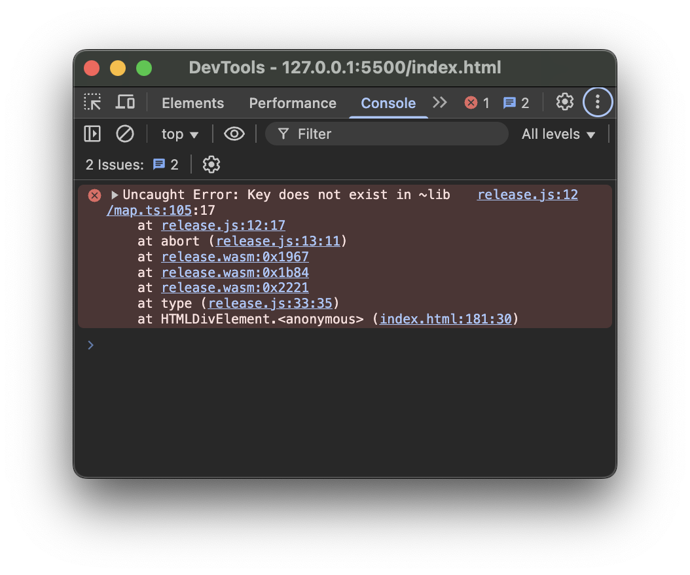

Пораскинув мозгами, видим, что валится функция `type` и идем смотреть че с ней не так

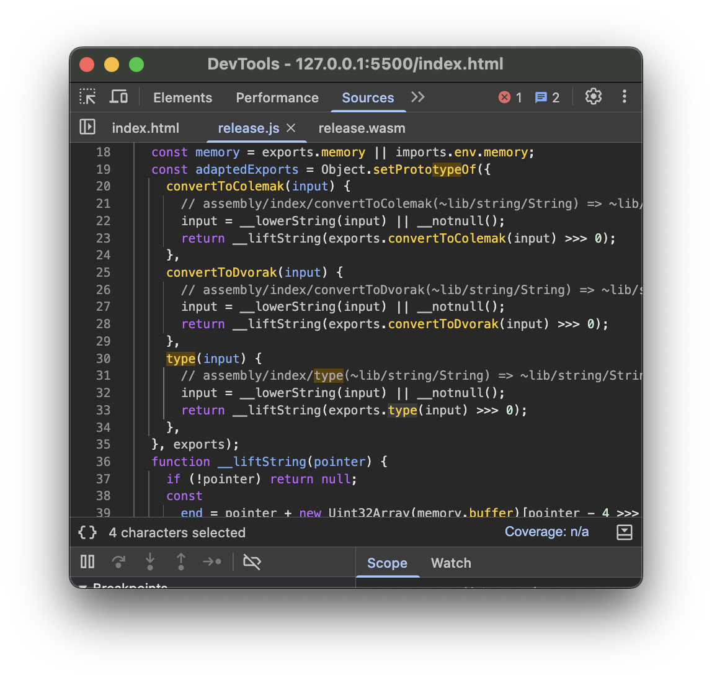

Далее видим еще какие-то 2 странные функции: `convertToColemak` и `convertToDvorak`. Я человек простой, вижу что-то непонятное, иду спрашивать мудрецов

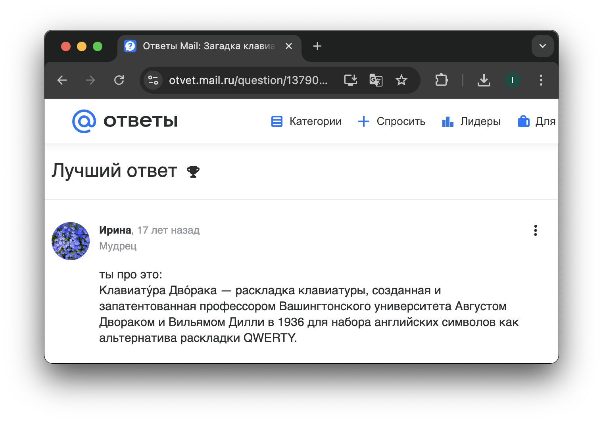

Давайте попробуем закинуть какой нибудь текст в такой конвертер Дворака

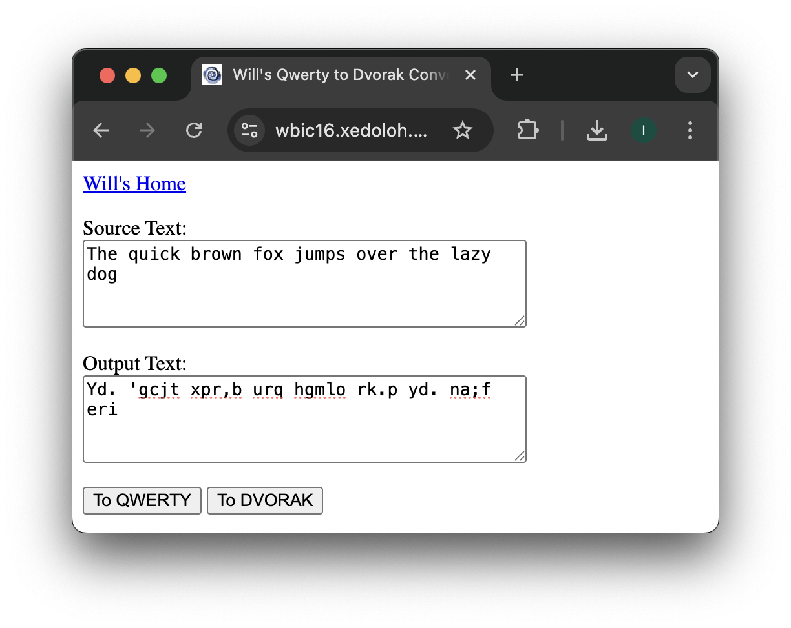

А ну-ка, ничего не напоминает? Закинем текст который был в коментарии и посмотрим че случится?

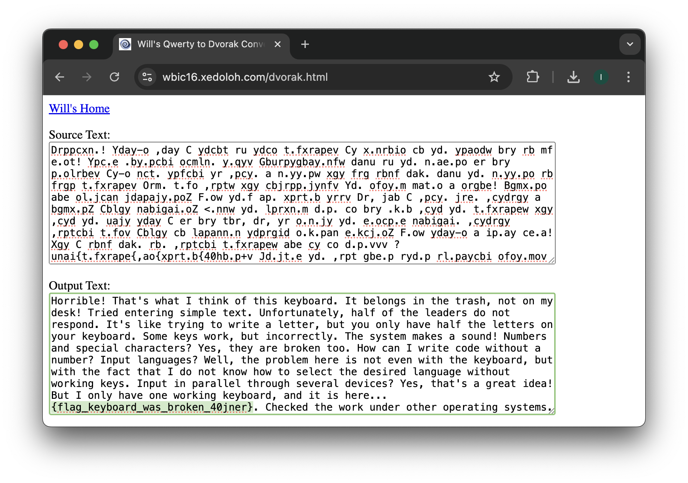

Вот мы и получили наш флажок, даже руки марать об wasm не пришлось

Флаг: `{flag_keyboard_was_broken_40jner}`


### Vault

Задание
>Опять Павел Семёнович что-то намудрил. Почему такой [странный интерфейс](https://hckrslgs.ctf-2025.ilovefrontend.ru/) ввода пароля?

Что увидим как зайдем?

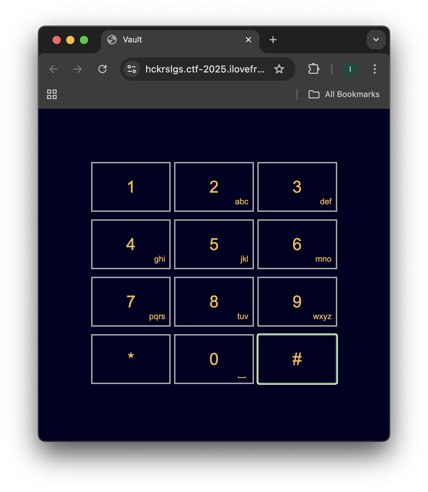

Инспектируем и узнаем следующее:
- При нажатии клавиши с 0-9 мы добавляем это число в строку
- При нажатии на # отправляем эту строку
- Звездочка нужна для аутентичности

Ясно-понятно, значит жмем на решеточку и смотрим что получаем в ответе:

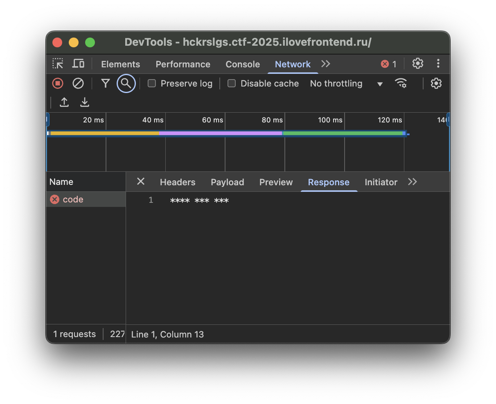

Хм, 403 статус код, да еще и какие-то звездочки, не уж-то патерн пароля?

`**** *** ***`

В чате CTF были подсказки про то, что пароль надо бы побрутить, и использовать лучше для этого "социальную инженерию"

А подсказки того, какой пароль наш Павел Семёнович мог поставить на сейф валяются на уровне

Вспоминаем раз:
>Что это в принтере?

>Это Павел Семёнович распечатал какой-то постер

>О это постер к фильму Хакеры 95-ого года!

Вспоминаем два:
> На таске c [PDF](#pdf) мы могли увидеть этот постер в файлах среди остальных документиков

Ну давайте ~~посмотрим фильм~~ попроуем поискать что-то и по запросу `hackers 1995 passwords` находим цитату:

> The Plague: Our recent unknown intruder penetrated using the superuser account, giving him access to our whole system.

> Margo: Precisely what you're paid to prevent.

> The Plague: Someone didn't bother reading my carefully prepared memo on commonly-used passwords. Now, then, as I so meticulously pointed out, the four most-used passwords are: love, sex, secret, and...

> Margo: [glares at The Plague] 

> The Plague: god. So, would your holiness care to change her password?

Вспоминаем про паттерн, и думаем, значит каждая цвездочка это символ (не цифра которая отправляется) а пробел это 0

Поэтому есть вариант проверить паттерн следующими комбинациями `love sex god` и `love god sex`, как бы смешно это не звучало в переводе

Но сначала идем во вкладку `network` и копируем запрос в любом удобном формате (в моем случае fetch)

1. Проверяем первую комбинацию заранее воспользовавшись каким-нибудь сервисом для перевода текста в телефонную "раскладку" (только не Т9)

```
love sex god -> 55566688833077773399046663
```

Отправляем запрос из консоли браузера прямо в задании:

```js
fetch("code", {
  "body": "{\"code\":\"55566688833077773399046663\"}",
  "method": "POST",
});

// out: 403: Пацан к успеху шел, не получилось, не фортануло 
```

2. Пробуем второй вариант

```
love sex god -> 55566688833046663077773399
```

Ну, понеслась!

```js
fetch("code", {
  "body": "{\"code\":\"55566688833046663077773399\"}",
  "method": "POST",
});

// out: 200: {flag_nokia_3310_rules}
```

Со второго первача получается!

Флаг: `{flag_nokia_3310_rules}`

### ch-ts

Задание
> Вот это я называю [естественной обфускацией](https://chtschts.ctf-2025.ilovefrontend.ru/). Попробую хотя бы в ASCII перевести, что ли.

И, видимо, сразу же заканчиваем

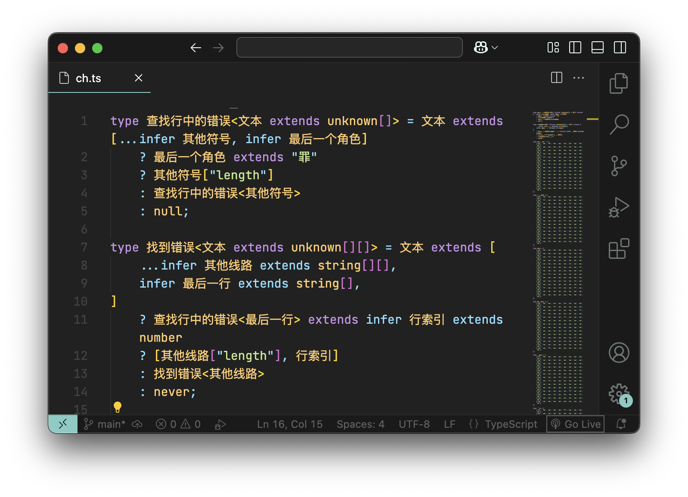

Но не так страшен черт как его малюют, давайте начнем "деобфусцировать" этот код

Вооружаемся переводчиком и в бой:

```
查找行中的错误 -> Найдите ошибки в строке -> TFindErrorInLine
文本 -> Заменим просто на T как это любят делать в дженериках
其他符号 -> Другие символы -> RestSybols
最后一个角色 -> Последняя роль -> LastSymbol
找到错误 -> Найдите ошибку -> TFindError
其他线路 -> Другие маршруты -> RestLines
最后一行 -> Последняя строка -> LastLine
行索引 -> Индекс Строки -> LineIndex

```

Ну вроде стало намного понятнее


На вход типа `TFindError` вкидывается типа двумерного массива, суть в том, что в дальнейшем оно ищет символ указанный в типе `TFindErrorInLine` и возвращает массив, где `[<ErrorLine>, <ErrorInLine>]`

Благо двумерных массивов у нас тут полно, а точнее 21

```ts
type 十四二十一 = TFindError<[...]>;

// подсказка типа выдает следующее
type 十四二十一 = [10, 5]
// все как и предполагали [<ErrorLine>, <ErrorInLine>]
```

Ну оно хотябы работает как и задуманно, уже хорошо, попробуем провернуть это все с остальными матрицами,

Ну теперь таких типов у нас целых 21, и во всех есть что-то странное, сейчас поделюсь наблюдениями. Когда ты играешь в CTF у тебя глаз ненароком замечает всякие значения, например:

```
hex: 0x61, ..., 0x7a
dec: 97, ..., 122
latin: a, ..., z
```

Не буду таить, да, сразу начинаешь замечать числовые значения символов латиницы в неожиданных местах, а все типы которые мы насоздавали, если схлопнуть массив в число, в пределах печатных символов.

Поэтому я чуть-чуть модифицировал тип чтобы он возвращал строку:

``` ts
// Было
...
? [RestLines["length"], LineIndex]
...

// стало
... 
 ? `${RestLines["length"]}${LineIndex}`
...
```

### Остальная китайщина

Такс, ну переводчик говорит мне ясно что все остальные непереведенные типы это числа, какие-то просто `Один Два Три`, какие-то `Один и Тринадцать, Два и Шестнадцать`, примеры написаны от балды, но суть общая такая, это все позиции символов в строке, а значит время раскукодживать все дальше

```
十四二十一 -> 14 и 21 -> T_14_21
四和十八 -> 4 и 18 -> T_4_18
十三 -> 13 -> T_13
...
```

И так далее. Потом мы выстраиваем все по порядку и собираем массив ascii кодов, которые потом переводим в строки и получаем наш флажок

```js
[
  "123", "102", "108", "97",
  "103", "95",  "116", "121",
  "112", "101", "115", "99",
  "114", "105", "112", "116",
  "95",  "97",  "115", "99",
  "105", "105", "95",  "104",
  "56",  "49",  "113", "125"
].reduce((acc, el) => acc += String.fromCharCode(el), '')
// out: {flag_typescript_ascii_h81q}
```

Флаг: `{flag_typescript_ascii_h81q}`


## Благодарности

Огромное спасибо организаторам за такой ламповый ивент, который помог отвлечься от нудности и рутины

Да, без душных заданий не обошлось (крути верти, флажочек найди), но это моя вкусовщина

Участвовал с вашего самого первого CTF, так что это событие стало небольшим праздником, в который можно оттянуться и порофлить с другими такими же людьми как я сам в чате
